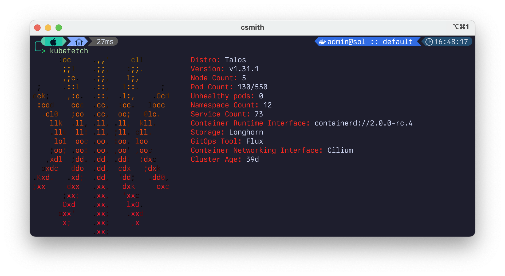

<div align="center">


### My Home Operations Repository :octocat:

_... managed with Flux, Renovate, and GitHub Actions_ 🤖

</div>

---

## 📖 Overview

This is a mono repository for my home infrastructure and Kubernetes cluster. I try to adhere to Infrastructure as Code (IaC) and GitOps practices using tools like [Kubernetes](https://kubernetes.io/), [Flux](https://github.com/fluxcd/flux2), [Renovate](https://github.com/renovatebot/renovate), and [GitHub Actions](https://github.com/features/actions).

---

## ⛵ Kubernetes

There is a template over at [onedr0p/cluster-template](https://github.com/onedr0p/cluster-template) that I used to create this repository. It is a good starting point for creating a new repository for your own cluster. Also consider joining the Home Operations discord!

### Installation

My Kubernetes cluster is deployed with [Talos](https://www.talos.dev). This is a semi-hyper-converged cluster - workloads and block storage are sharing the same available resources on my nodes, while I have a separate truenas server using ZFS for NFS/SMB shares, bulk file storage and backups.

### Core Components



- [cert-manager](https://github.com/cert-manager/cert-manager): Creates SSL certificates for services in my cluster.
- [cilium](https://github.com/cilium/cilium): Internal Kubernetes container networking interface.
- [cloudflared](https://github.com/cloudflare/cloudflared): Enables Cloudflare secure access to certain ingresses.
- [external-dns](https://github.com/kubernetes-sigs/external-dns): Automatically syncs ingress DNS records to a DNS provider.
- [SOPS](https://github.com/getsops/sops): encrypted Kubernetes secrets using [age](https://github.com/FiloSottile/age)
- [ingress-nginx](https://github.com/kubernetes/ingress-nginx): Kubernetes ingress controller using NGINX as a reverse proxy and load balancer.
- [sops](https://github.com/getsops/sops): Managed secrets for Kubernetes and Terraform which are commited to Git.
- [spegel](https://github.com/XenitAB/spegel): Stateless cluster local OCI registry mirror.
- [volsync](https://github.com/backube/volsync): Backup and recovery of persistent volume claims.

### GitOps

[Flux](https://github.com/fluxcd/flux2) watches the clusters in my [kubernetes](./kubernetes/) folder (see Directories below) and makes the changes to my clusters based on the state of my Git repository.

The way Flux works for me here is it will recursively search the `kubernetes/apps` folder until it finds the most top level `kustomization.yaml` per directory and then apply all the resources listed in it. That aforementioned `kustomization.yaml` will generally only have a namespace resource and one or many Flux kustomizations (`ks.yaml`). Under the control of those Flux kustomizations there will be a `HelmRelease` or other resources related to the application which will be applied.

[Renovate](https://github.com/renovatebot/renovate) watches my **entire** repository looking for dependency updates, when they are found a PR is automatically created. When some PRs are merged Flux applies the changes to my cluster.

### Directories

This Git repository contains the following directories under [Kubernetes](./kubernetes/).

```sh
📁 kubernetes
├── 📁 apps           # applications
├── 📁 bootstrap      # bootstrap procedures
├── 📁 flux           # core flux configuration
└── 📁 templates      # re-useable components
```


### Networking

tbd! using cilium as my cni provider

---

## ☁️ Cloud Dependencies

While most of my infrastructure and workloads are self-hosted I do rely upon the cloud for certain key parts of my setup. This saves me from having to worry about two things. (1) Dealing with chicken/egg scenarios and (2) services I critically need whether my cluster is online or not.

The alternative solution to these two problems would be to host a Kubernetes cluster in the cloud and deploy applications like [HCVault](https://www.vaultproject.io/), [Vaultwarden](https://github.com/dani-garcia/vaultwarden), [ntfy](https://ntfy.sh/), and [Gatus](https://gatus.io/). However, maintaining another cluster and monitoring another group of workloads is a lot more time and effort than I am willing to put in.

| Service                                         | Use                                                               | Cost           |
|-------------------------------------------------|-------------------------------------------------------------------|----------------|
| [Cloudflare](https://www.cloudflare.com/)         | DNS, Argo Tunnels                                                 | Free           |
| [GitHub](https://github.com/)                   | Hosting this repository and continuous integration/deployments    | Free           |
| [NextDNS](https://nextdns.io/)                  | My router DNS server which includes AdBlocking                    | ~$20/yr        |
|                                                 |                                                                   | Total: ~$20/yr |

---

## 🌐 DNS

### Home DNS

to be determined - likely going to install technetium for split horizon dns so I can resolve internal services locally. the template has a k8s_gateway setup I'd like to leverage.

### Public DNS

Using cloudflare with cloudflared tunnels for now, and then manually creating public dns records until I set up another external-dns deployment.

---

## 🔧 Hardware

| Device                      | Count | OS Disk Size | Data Disk Size              | Ram  | Operating System | Purpose                |
|-----------------------------|-------|--------------|-----------------------------|------|------------------|------------------------|
| Intel NUC7i5BNK             | 1     | 1TB SSD      | TODO                        | 16GB | Talos            | getting started node   |
| Homebuilt PC (Ryzen 5600G)  | 1     | 512GB SSD    | TODO                        | 32GB | Talos            | the real workhorse     |
| Intel NUC8i7BEH             | 1     | 1TB SSD      | TODO                        | 16GB | Talos            | thank u klipper ❤️      |


---

## 🤝 Gratitude and Thanks

Special thanks goes out to [onedr0p](https://github.com/onedr0p) for his awesome [template](https://github.com/onedr0p/cluster-template) and [readme](https://github.com/onedr0p/home-ops) which i have shamelessly stolen and tweaked.

Thanks to all the people who donate their time to the [Home Operations](https://discord.gg/home-operations) Discord community. Be sure to check out [kubesearch.dev](https://kubesearch.dev/) for ideas on how to deploy applications or get ideas on what you may deploy.
